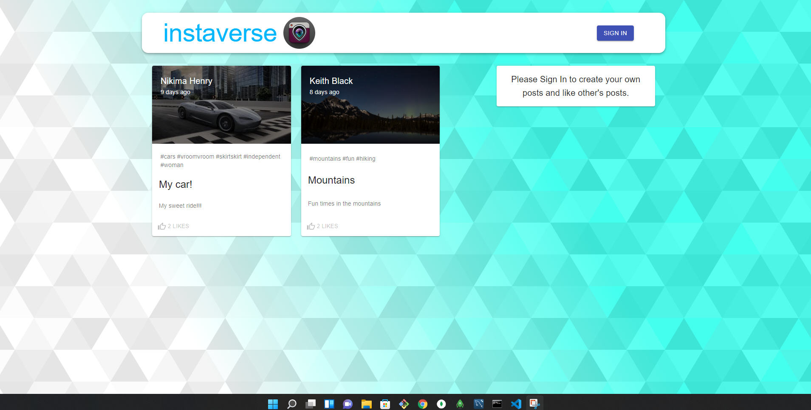
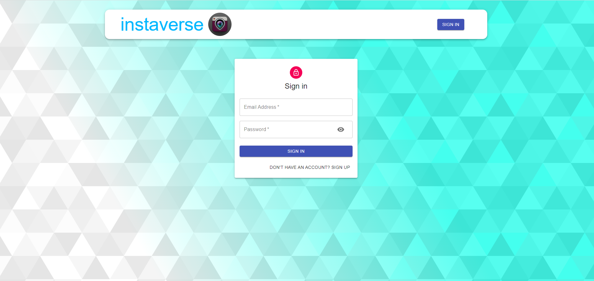
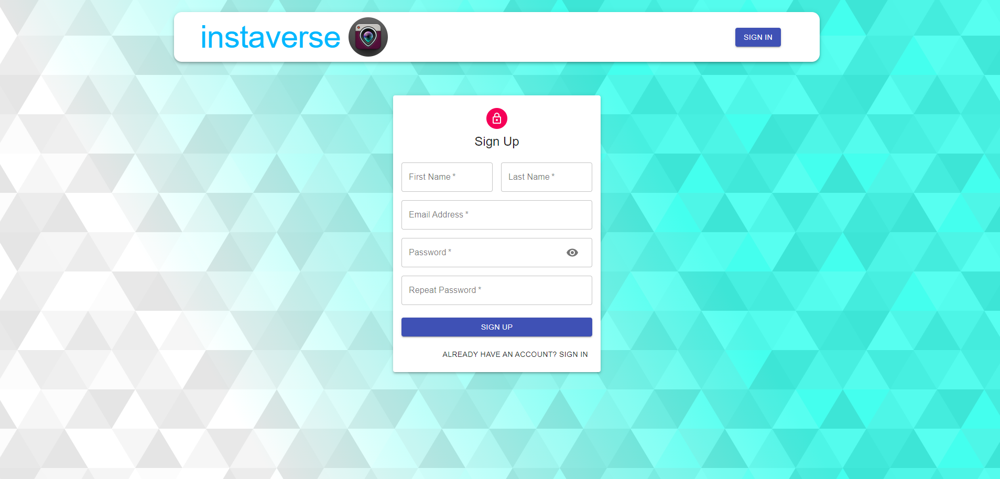
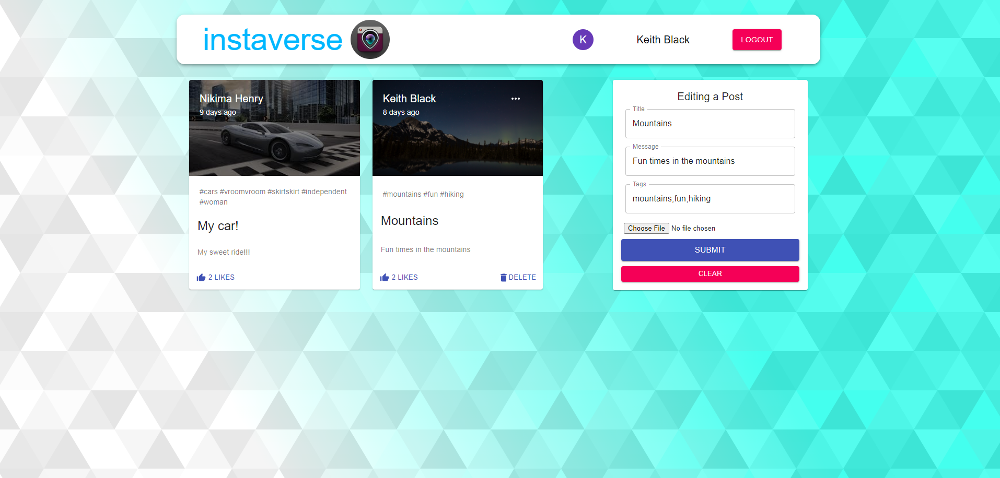

#  instaverse

## Table of Contents

- [ instaverse](#-instaverse)
  - [Table of Contents](#table-of-contents)
  - [Description](#description)
  - [Usage](#usage)
  - [Technologies](#technologies)
  - [Deployed Application](#deployed-application)
  - [Screenshots of Application](#screenshots-of-application)
    - [Homepage:](#homepage)
    - [Signin Page:](#signin-page)
    - [Signup Page:](#signup-page)
    - [Profile Page:](#profile-page)
    - [Edit:](#edit)
  - [License](#license)

## Description

Instaverse is a full stack MERN application. Users are able to signup to create a profile. They can then upload photos with a title, description, and hashtags. Users can interact with one another by liking each others posts. If the owner of a post does not like how their post looks then they have an option to edit or delete their post.

This application is ideal for people who like to share their favorite photos and view other users experiences.

## Usage

Once a user visits instaverse, they will be presented with a homepage that will show current posts by other users. They will not be able to interact or create their own posts until they have signed up. A user can sign up by selecting the sign in button in the navigation bar.

Once the sign in is selected they will be presented with the sign in form. If they have an existing account then they can proceed by entering in their credentials. If they do not have an account then they can select the sign up option at the bottom of the sign in component.

Once the user is signed in to the application they can create their own post by filling out the create post form in their profile. Once they have filled out the form and selected a photo from their local files they can submit the post. If they do not like their post then they can edit it by selecting the edit option on the top right corner of their post. If they want to completely discard the post then they can simply select delete and the post will no longer exist.

A user will see their post with other users posts. If they enjoy another users post then they can like the post one time. If the user decides they no longer like the post then they can simple unlike it by selecting like again.

## Technologies

- [JavaScript](https://developer.mozilla.org/en-US/docs/Web/JavaScript)
- [Node.js](https://nodejs.org/en/)
- [React](https://reactjs.org/)
- [Redux](https://redux.js.org/)
- [axios](https://www.npmjs.com/package/axios)
- [React File Base64](https://www.npmjs.com/package/react-file-base64)
- [MongoDB](https://www.mongodb.com/)
- [mongoose](https://www.npmjs.com/package/mongoose)
- [dotenv package](https://www.npmjs.com/package/dotenv)
- [bcrypt package](https://www.npmjs.com/package/bcrypt)
- [express-session](https://www.npmjs.com/package/express-session)
- [Material-UI](https://mui.com/)
- [Json Web Token](https://jwt.io/)
- [Moment](https://momentjs.com/)

## Deployed Application

- [instaverse](https://instaverse.herokuapp.com/)

## Screenshots of Application

### Homepage:

### Signin Page:

### Signup Page:

### Profile Page:

### Edit:

## License

Copyright &copy; 2021 Keith Black

Permission is hereby granted, free of charge, to any person obtaining a copy
of this software and associated documentation files (the "Software"), to deal
in the Software without restriction, including without limitation the rights
to use, copy, modify, merge, publish, distribute, sublicense, and/or sell
copies of the Software, and to permit persons to whom the Software is
furnished to do so, subject to the following conditions:

The above copyright notice and this permission notice shall be included in all
copies or substantial portions of the Software.

THE SOFTWARE IS PROVIDED "AS IS", WITHOUT WARRANTY OF ANY KIND, EXPRESS OR
IMPLIED, INCLUDING BUT NOT LIMITED TO THE WARRANTIES OF MERCHANTABILITY,
FITNESS FOR A PARTICULAR PURPOSE AND NONINFRINGEMENT. IN NO EVENT SHALL THE
AUTHORS OR COPYRIGHT HOLDERS BE LIABLE FOR ANY CLAIM, DAMAGES OR OTHER
LIABILITY, WHETHER IN AN ACTION OF CONTRACT, TORT OR OTHERWISE, ARISING FROM,
OUT OF OR IN CONNECTION WITH THE SOFTWARE OR THE USE OR OTHER DEALINGS IN THE
SOFTWARE.
